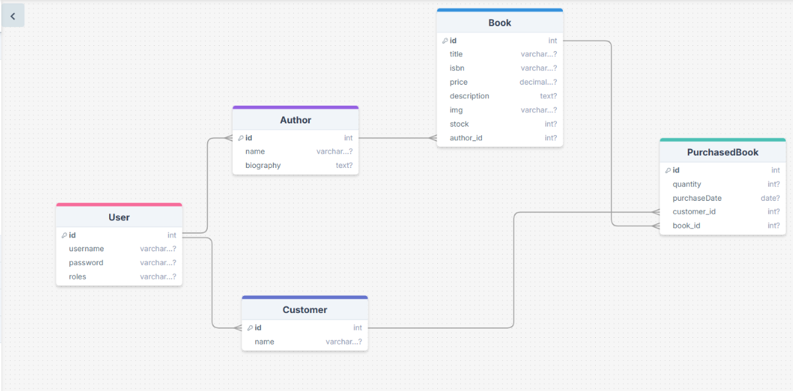

# 📚 Book Store Service

## 📝 Overview
This project is a **Book Store Service** built with **Spring Boot**, designed to manage authors, books, customers, and their purchases. It supports full **CRUD operations**, input validation, custom exception handling, logging, testing, Swagger UI for API documentation, and code quality tools such as **JaCoCo** and **SonarQube**.
 
---

## ✨ Features
- ✅ Create, Read, Update, Delete operations for:
    - Authors
    - Books
    - Customers
    - Purchased Books
- 👨‍💼 Author can have multiple books (one-to-many)
- 📖 Book can exist without an author or be assigned to one
- 🛒 Customers can purchase multiple books
- 🔁 REST endpoints return appropriate HTTP status codes and ResponseEntity
- 🗃️ In-memory Postgres Database
- 📄 API documentation with Swagger-UI
- 📊 Code coverage and quality checks using JaCoCo and SonarQube
- 🧾 Logging and exception handling in place
- 🔄 Clean DTO ↔ DAO mapping using MapStruct

---

## 🛠️ Technologies Used

| Technology     | Description                        |
|----------------|------------------------------------|
| Spring Boot    | Backend framework                  |
| Maven          | Build and dependency management    |
| H2/PostgreSQL  | Relational database                |
| Swagger-UI     | API documentation                  |
| MapStruct      | DTO-Entity mapping                 |
| Lombok         | Boilerplate code reduction         |
| JaCoCo         | Code coverage                      |
| SonarQube      | Code quality analysis              |
| JUnit + Mockito| Testing framework                  |
 
---

## 🔗 Entity Relationships

- 👨‍💼 **Author ↔ Book**
    - One author can write multiple books
    - A book may or may not be associated with an author

- 🧑‍💻 **Customer ↔ PurchasedBook**
    - Customers can purchase many books

---

## 🌐 REST Endpoints

### 📘 Book
- `GET /api/v1/books/{id}`
- `PUT /api/v1/books/{id}`
- `DELETE /api/v1/books/{id}`
- `GET /api/v1/books`
- `POST /api/v1/books`
- `PATCH /api/v1/books/{id}/add-stock`
- `PATCH /api/v1/books/{id}/assign-author/{author-id}`
- `GET /api/v1/books/{id}/image`

### 👨‍💼 Author
- `GET /api/v1/author/{id}`
- `PUT /api/v1/author/{id}`
- `DELETE /api/v1/author/{id}`
- `GET /api/v1/author`

### 🧑‍💻 Customer
- `GET /api/v1/customers/{id}`
- `PUT /api/v1/customers/{id}`
- `DELETE /api/v1/customers/{id}`
- `GET /api/v1/customers`

### 🛒 Purchased Book
- `POST /api/v1/purchases`

### 🔐 Authentication Controller
- `POST /api/v1/auth/register/customer`
- `POST /api/v1/auth/register/author`
- `POST /api/v1/auth/login`

---

## 🧪 Testing
- ✅ Unit and integration tests implemented using **JUnit** and **Mockito**
- 🧬 Tests cover all layers
- 📈 Code coverage verified using **JaCoCo**

---

## 📊 Code Quality Tools
- **JaCoCo**: Generates code coverage reports
- **SonarQube**: Performs code quality analysis

---

## 🎯 Project Goals
This Book Store REST API is designed to demonstrate:
- 🧼 Clean architecture using Spring Boot
- 🔁 Real-world CRUD operation implementation
- 🔗 Entity relationships and data management
- 🧪 Testing, validation, and observability

---
## Entity Relationship Diagram

---